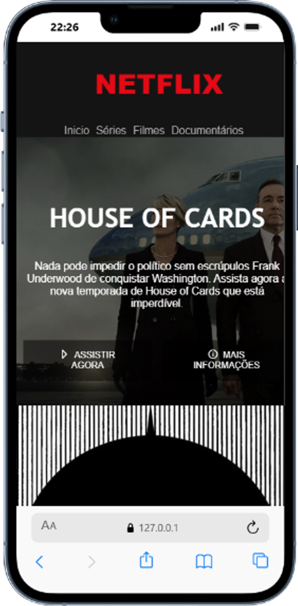
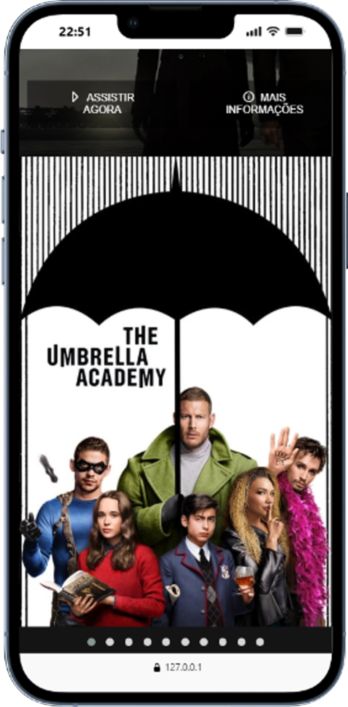
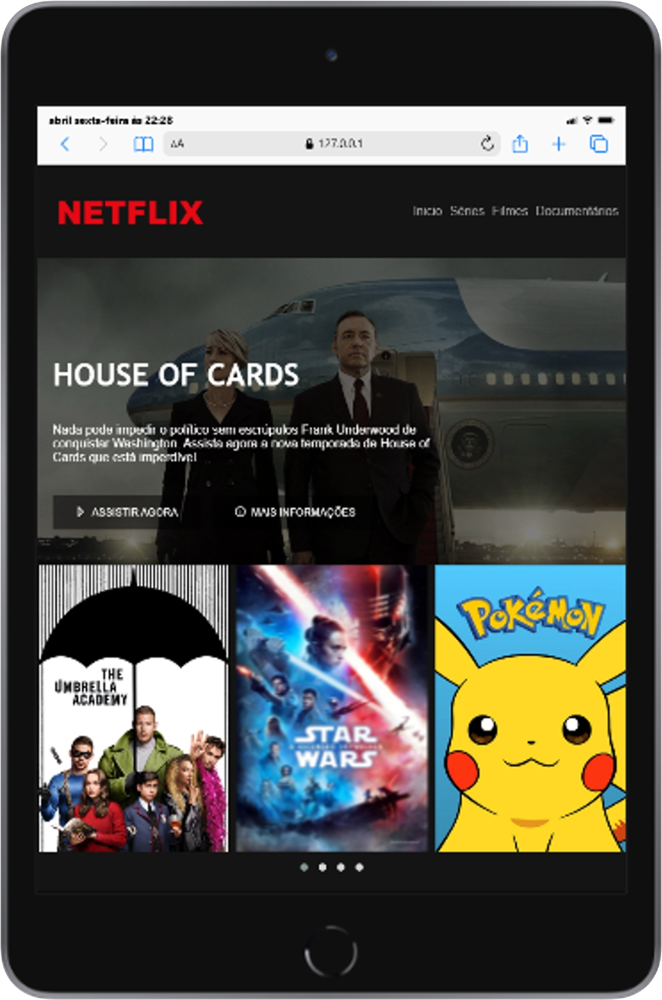
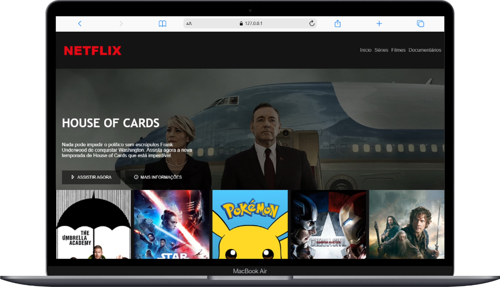

# 🍿 Miriã Amaral - Clone Interface Netflix 🎬💻

E aí, meu 🐙! Bem-vindo(a) a mais um desafio da minha jornada como Desenvolvedora Front-End! Este projeto é uma recriação da clássica interface da Netflix. Mais do que apenas copiar o visual, aproveitei este projeto para refinar minha arquitetura de código, aplicando padrões profissionais que vão além do que foi ensinado na aula original.

## Clone Interface Netflix

Este repositório contém o código-fonte do clone da página inicial da Netflix. O objetivo principal foi treinar a construção de layouts complexos e responsivos, focando em manter o código limpo, escalável e fácil de dar manutenção.

---

## *🎥 Veja o Projeto em Ação!*

Que tal dar uma olhada na interface ao vivo?
[Clone Netflix Funcionando](https://miriaamaral.github.io/JS-interfaceNetflix/)

---

## 🧠 Meu Diferencial: Aulas vs. Minha Abordagem

Durante o desenvolvimento deste projeto acompanhando as aulas, percebi algumas oportunidades de melhorar a estrutura do código baseada em boas práticas atuais de mercado. Aqui estão os ajustes que fiz de forma diferente do meu professor:

* **HTML Semântico ao invés de "Divite":** Enquanto as aulas originais utilizavam muitas `
` genéricas para agrupar elementos, eu optei por refatorar o código utilizando tags semânticas do HTML5 (como `<header>`, `<main>`, `<section>`, `<nav>` e `<button>`). Isso melhora drasticamente a **Acessibilidade (A11y)** para leitores de tela e o **SEO** da página.
* **Metodologia BEM no CSS:** O professor utilizou classes CSS mais genéricas e acopladas. Para garantir que o projeto pudesse escalar sem conflitos de estilo, apliquei a metodologia **BEM (Block, Element, Modifier)**. Com classes classes utilitárias e variaveis de estilo, o código ficou muito mais modular e previsível.

---

## 💡 Funcionalidades Destaque

* **Design Responsivo:** A interface se adapta perfeitamente a diferentes tamanhos de tela (Mobile, Tablet e Desktop).
* **Efeitos de Hover (Transições):** Animações suaves nos botões e nos cards de filmes, trazendo a experiência fluida característica da Netflix original.
* **Código Modular:** Estruturação de pastas e estilos pensada para facilitar futuras manutenções.

---

## 🛠 Tecnologias Utilizadas

* **HTML5:** Estruturação semântica e acessível.
* **CSS3:** Estilização baseada em Flexbox, Grid e metodologia BEM.
* **JavaScript:** Lógica que aplicarei.
* **Git & GitHub:** Controle de versão e hospedagem do projeto.

> **⏳ Próximos Passos (JavaScript):** Toda a estruturação visual (UI) já está finalizada com excelência. A parte da lógica de interatividade no DOM com **JavaScript** (como o scroll dinâmico dos carrosséis) não foi aplicada neste primeiro momento, mas será a próxima melhoria a ser implementada neste repositório! 🚀

---

    <h3>🔗 Veja este Desafio Online:</h3>
    

## ✉️ Contato

Vamos nos conectar e construir algo incrível juntos!

* **LinkedIn:** [Miriã Amaral](https://www.linkedin.com/in/miriaamaralcs)
* **GitHub:** [miriaamaral](https://github.com/miriaamaral)
* **Email:** [miriaamaralcs@gmail.com](mailto:miriaamaralcs@gmail.com)
* **Discord:** [miriaamaralcustodiosantos](https://discord.com/channels/miriaamaralcustodiosantos)

---

Feito com ❤️ por Miriã Amaral
